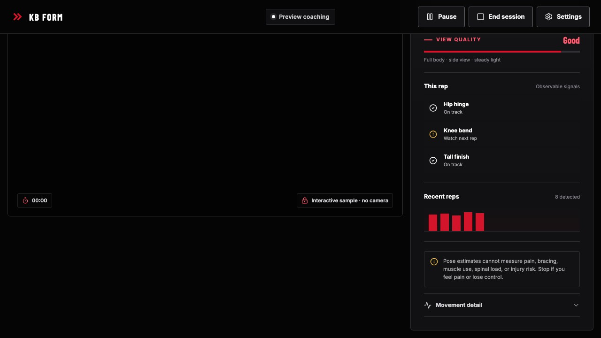
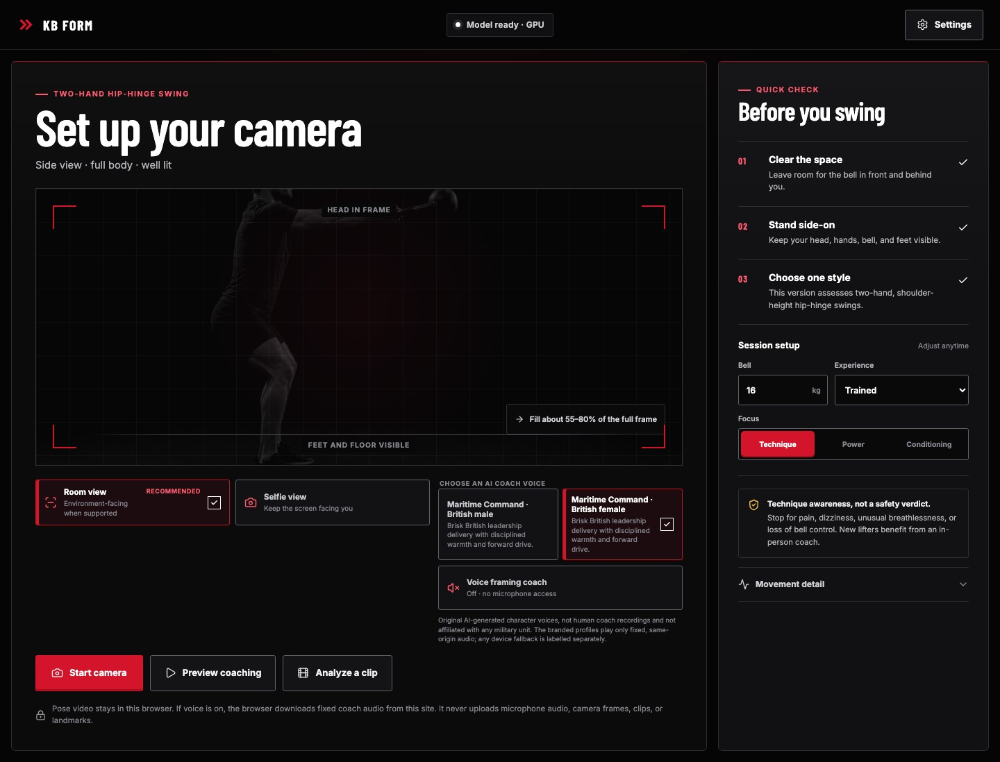
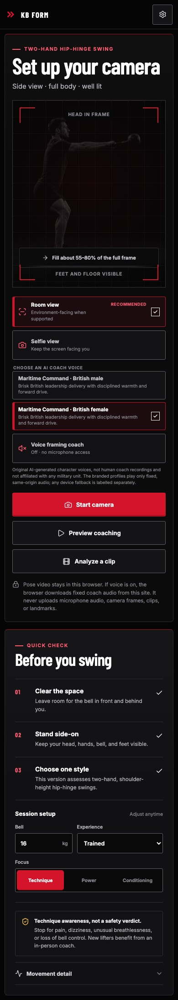
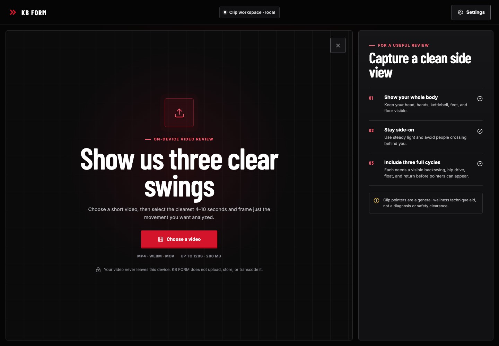
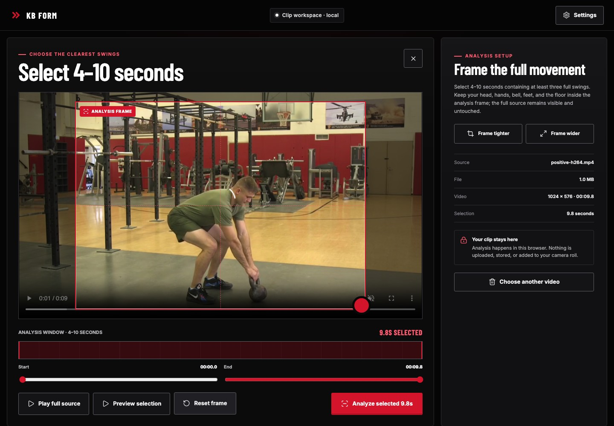
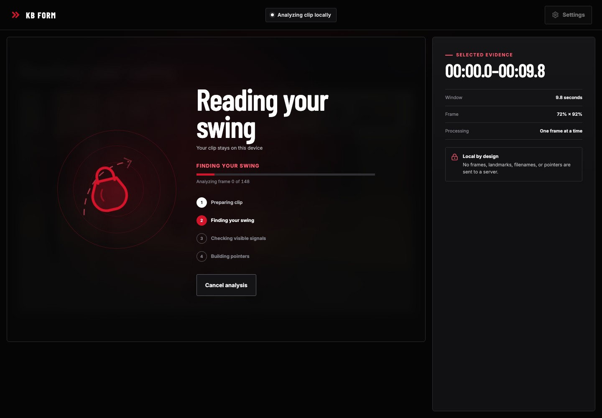
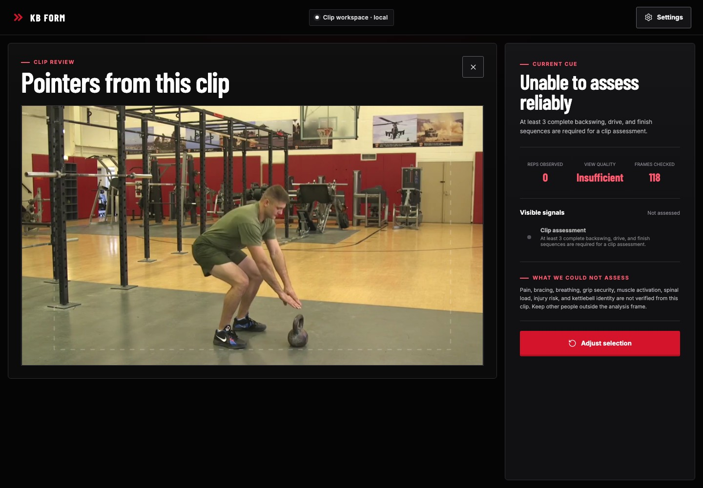

# KB FORM

[](https://github.com/sergiopesch/kettlebellform/actions/workflows/ci.yml)
[](https://github.com/sergiopesch/kettlebellform/actions/workflows/codeql.yml)
[](https://kettlebellform.vercel.app)

A browser-based technique-awareness coach for one deliberately narrow movement: the two-hand, shoulder-height, hip-hinge kettlebell swing. Camera and clip pixels plus derived landmarks stay in the browser's analysis path.

[Open KB FORM](https://kettlebellform.vercel.app) · [Read the technical audit](docs/AUDIT_REPORT.md) · [Review video compatibility](docs/VIDEO_COMPATIBILITY.md) · [Review voice provenance](docs/VOICE_PACK.md) · [Review the evidence boundary](docs/EVIDENCE_AND_SAFETY.md)



KB FORM turns a side-view camera feed or a locally selected video clip into confidence-aware movement cues without sending video frames to an application server. It is a general-wellness engineering prototype—not a safety verdict, medical device, injury predictor, or replacement for a qualified coach.

“In-browser” describes the user-media path, not a blanket offline guarantee. Installation fetches the pinned pose model unless an authentic cached copy exists; the optional device-speech fallback is controlled by the browser or operating system; and deployed network/MediaPipe telemetry inspection remains a release gate.

## Product experience

- **Full-frame adaptive camera:** Room view requests an environment-facing 4:3 feed when the browser supports it, Selfie view remains available, and both the preview and pose overlay use the complete uncropped camera frame. After permission, exposed cameras can be selected explicitly.
- **Arena Red visual system:** an original near-black, white, and red performance identity uses white-on-red actions, brighter accessible red for small labels and focus, visible selection checks, and colour-independent status cues.
- **Opt-in British Maritime Command voices:** two original, non-impersonating AI character voices deliver the fixed camera-positioning cues from a 323,166-byte, same-origin, SHA-256 integrity-checked audio pack. The branded path uses no microphone, runtime synthesis provider, WebRTC session, or server function.
- **Local clip review:** choose a natively supported video up to 120 seconds and 200 MiB, then select a continuous 4–10 second analysis window and normalized spatial frame containing at least three complete swings.
- **No-camera preview:** the complete coaching interface can be explored without activating a camera.
- **Fail-closed analysis:** malformed, stale, interrupted, low-visibility, or out-of-order pose sequences return **Not assessed**.
- **Ordered repetition logic:** a rep requires a continuous backswing → drive → float/finish sequence.
- **One useful cue at a time:** feedback is limited to observable movement patterns supported by the current landmarks.
- **Responsive and accessible controls:** keyboard navigation, focus management, live status semantics, reduced motion, 44 px touch targets, and layouts tested down to 320 px.

### Camera setup





### Local clip review

The repository's clip workflow keeps the complete source available for local preview while sending only the selected time window and spatial frame through pose analysis. The selection is non-destructive: KB FORM does not upload, persist, transcode, or create a shortened copy of the video, and clip names, frames, and results are excluded from analytics.

Video decoding uses the browser's native media stack. Clean end-of-file, native media errors, frame extraction, and pose inference have separate lifecycle signals and watchdogs, so a completed clip is not mistaken for a stalled decoder. Detected unsupported, damaged, or incomplete media fails closed with specific recovery guidance rather than being transferred elsewhere. The [public-video compatibility matrix](docs/VIDEO_COMPATIBILITY.md) records the tested sources, hashes, transformations, outcomes, and remaining device coverage.









## Runtime architecture

```text
camera → requestVideoFrameCallback → temporal VIDEO detection (up to two poses)
       → require exactly one pose and three continuous identity frames
local clip → 4–10 s window → normalized ROI → crop/downscale max 640 px
           → sample at no more than 15 fps → stateless IMAGE detection
           → detect up to two poses → accept evidence only when exactly one is found
both → one transferable ImageBitmap in flight, with no frame queue
  → dedicated MediaPipe inference Worker
  → landmark validity, visibility, and continuity gates
  → deterministic SwingAnalyzer state machine
  → confidence-aware cue and overlay UI

optional voice opt-in → resume one user-activated Web Audio context
  → stream the selected versioned 11-clip same-origin pack in parallel
  → enforce a 15 s per-asset deadline and exact manifest-sized byte ceiling
  → verify SHA-256 before decoding and caching bounded audio buffers
  → play one allowlisted cue at a time with latest-cue-wins cancellation
  → browser-reported local English speech fallback if available
```

Live capture requests a best-effort native 4:3 mode with browser cropping disabled, inspects the granted track rather than assuming a lens, and applies minimum zoom only when an already-authorized track explicitly exposes a safe numeric range. Camera labels are never treated as machine-readable proof of field of view. The UI letterboxes mismatched aspect ratios with `object-fit: contain`, keeping presentation aligned with the full frame already sent to inference. Camera switching stops the old track before requesting an explicitly selected `deviceId`, and unavailable devices fall back without retrying denied permission. Mirroring follows reported track metadata; a visible mirror control is the honest fallback when a browser omits that metadata. Live inference requests up to two poses, requires exactly one, and withholds analysis and speech until three geometrically continuous frames reacquire the subject. Ambiguity, identity discontinuity, camera changes, and session end reset retained coaching state and any saved reference; this conservative gate is not biometric identity or proof that no bystander was missed.

The voice framing state machine consumes the on-device landmark stream, but landmarks never enter the speech request. Corrections must remain stable before they are committed, unresolved cues repeat slowly, and speech is suppressed during swings, for four seconds after recent movement, and during calibration, pause, demo, hidden-page, and ended-session states. Visual text and direction controls remain the baseline whether speech is enabled or not.

The initial app bundle stays separate from the Worker and the optional Three.js movement view. Clip playback pauses through extraction and inference for each sampled frame, keeps at most one transferable frame in flight and no frame queue, and then resumes at up to 4× on GPU or 2× on CPU. Native `ended` handling drains the final in-flight frame before settling. Decoder, bitmap-extraction, Worker-inference, and whole-run timeouts report distinct failures. Inference prefers GPU and retries on CPU with a fresh MediaPipe module loader if GPU initialization fails. Frame responses are correlated to an exact Worker, job, and frame; cancelling or timing out an already-transferred frame replaces only that Worker and keeps new analysis disabled until the replacement reports ready.

MediaPipe `0.10.35`, its SIMD WASM runtime, and the full float16 pose model are pinned. `npm ci` copies the runtime from the locked package and installs the revisioned model through a deadline-bound streaming download with declared- and actual-byte ceilings, incremental SHA-256 verification, a private per-invocation temporary file, bounded cleanup of old dead-owner download remnants, and atomic promotion. The verified model is staged with the brand fonts as a same-origin production asset. Runtime camera and clip sessions therefore do not depend on Google Fonts, jsDelivr, or Google Storage.

## Optional AI voice framing

The selectable profiles are original fictional characters—not recordings of a coach, imitations of a named person, or representations of a real military unit:

| Profile | Character | Intended presentation |
| --- | --- | --- |
| Maritime Command · British male | Harbour | Brisk British leadership delivery with disciplined warmth and forward drive |
| Maritime Command · British female | Crown | The same pace, attack, confidence, warmth, and forward drive |

The `maritime-command-v2` references and production phrases were generated locally with pinned 1.7B MLX conversions of [Qwen3-TTS VoiceDesign](https://huggingface.co/Qwen/Qwen3-TTS-12Hz-1.7B-VoiceDesign) and [Qwen3-TTS Base](https://huggingface.co/Qwen/Qwen3-TTS-12Hz-1.7B-Base). The public Hugging Face Space was unavailable because its ZeroGPU quota was exhausted and did not generate this candidate. Both identities used the same semantic British leadership brief and exact reference transcript; the only intended difference is vocal presentation. Only final mastered MP3 files ship. The private references and reusable clone material are excluded from the browser build.

The historical v2 identity-design prompt was not retained byte for byte, so that limitation remains explicit. Future reference rounds use a serialized, fail-closed `stage → prepare → generate → verify` workflow. It binds the authenticated uv/CPython runtime, complete hash-locked package graph, exact prompts, seeds, sampling settings, model revisions, a private staged-model content-tree attestation, candidate paths, and script hash before inference can start; the cached model tree is re-hashed immediately before loading. It never promotes audio automatically, and symlinked receipts or recorded outputs are rejected. Accent authenticity and leadership energy remain a blind human listening gate.

The pack contains every combination of two profiles and eleven exact allowlisted messages. Each of the 22 clips is 24 kHz mono MP3, mastered between −17 and −15 LUFS with true peak below −1 dBTP. The complete pack is 323,166 bytes. Harbour's phrases total 19,300 ms and Crown's total 19,133 ms—a 0.87% delta—and their mean integrated loudness differs by 0.036 LU. A committed manifest records the exact phrase, model revisions, byte length, duration, loudness, SHA-256, licence, and non-impersonation provenance for every asset. `npm run voice:verify` independently checks the media, manifest, and pair parity with FFmpeg and FFprobe. The v2 pack remains a candidate pending blind human listening approval for accent, energy, naturalness, and intelligibility.

The repository and local production preview include that candidate so its runtime boundary can be tested; inclusion is not human release approval. The live badge points to the current `master` deployment, which may not contain this uncommitted worktree. Confirm the deployed commit and complete the listening gate before describing a deployed pack as approved.

Nothing is fetched before explicit opt-in. The click synchronously creates or resumes one low-latency Web Audio context before asynchronous work, preserving Safari's user-activation requirement. The selected profile's files are streamed in parallel from hashed same-origin URLs under a non-weakenable 15-second per-asset deadline into buffers capped at each manifest-declared byte length. Declared or actual overflow, timeout, cancellation, MIME mismatch, size mismatch, or SHA-256 mismatch fails closed before decoding. Valid clips are decoded once and cached in memory. One owned source can play at a time; replacement, profile change, motion, pause, page hiding, session end, disable, and unmount invalidate stale work and stop output with a short fade.

The branded pack sends no prompt, cue, landmark, frame, clip, microphone stream, account key, or reusable voice embedding to OpenAI, Hugging Face, or another runtime speech provider. If an asset, integrity check, decoder, or autoplay operation fails, the app can use a browser-reported local English system voice and clearly warns that sound and OS/browser privacy behaviour vary. Visual guidance remains the baseline.

See [Voice-pack generation, provenance, mastering, and release checks](docs/VOICE_PACK.md).

## Coaching and claims boundary

The current analyzer can report pose visibility, swing phase, completed rep count, hinge/knee relationships, shoulder lift, torso/head stack, and camera quality when evidence is sufficient.

Ordinary monocular pose landmarks cannot measure pain, breathing, bracing, muscle activation, spinal load, tissue capacity, kettlebell force, or injury risk. The body, region, skeleton, trail, and optional 3D layers are illustrative views—not anatomical or clinical measurements.

Stop for pain, dizziness, unusual breathlessness, or loss of bell control. New lifters benefit from in-person instruction.

## Local development

Requirements:

- Node.js 24.18.1 (the exact CI and `.nvmrc` release)
- npm 11.16.0 (the exact CI and `packageManager` release; compatible npm 11 is accepted for ordinary local development)
- Python 3.12.13 for the portable frozen voice-runtime and reference-workflow checks
- A modern browser with module Workers, WebAssembly, `ImageBitmap`, camera APIs, Web Audio, and Web Crypto; local speech synthesis is an optional failure fallback
- FFmpeg and FFprobe for `npm run check`, `npm run voice:verify`, or voice mastering; they are not needed for the basic development server

```bash
npm ci
npm run dev
```

`npm ci` runs the model-asset installer. On a first install it needs HTTPS access to the exact revisioned model URL; an already cached model is accepted only after its size and SHA-256 pass. A missing, stalled, oversized, or mismatched download fails the install instead of leaving an unverified runtime asset.

Open the printed `127.0.0.1` URL. For live analysis, keep the recommended **Room view** to request an environment-facing camera when supported or choose **Selfie view**, optionally enable **Voice framing coach**, and select **Start camera**. Once permission is granted, choose among the cameras the browser exposes. Use **Preview coaching** for the camera-free demonstration, or **Analyze a clip** and then **Choose a video** for the local clip workflow. Clip support depends on the browser's native decoders.

### Quality commands

```bash
npm run check          # voice/runtime checks + lint + types + coverage + verified build
npm test               # deterministic unit and component tests
npm run test:watch     # local test loop
npm run test:e2e:install # one-time browser install; append -- --with-deps on a clean Linux host
npm run test:e2e       # browser regression suite across all three projects
npm run voice:runtime:check # authenticated frozen voice-runtime manifest and lock
npm run voice:verify   # hashes, media shape, duration, loudness, and peak limits
npm run audit:prod     # production dependency audit
npm run audit:all      # complete production and development dependency audit
npm run verify:all     # complete local release gate: check + three-browser E2E + full audit
npm run preview        # serve the production build locally
```

`npm run build:verify` enforces required deployment files, the pose-model checksum, the exact 22-file voice pack, same-origin runtime policy, self-hosted font and voice-pack budgets, security configuration, SPA fallback, source-map policy, initial/chunk budgets, and a total-output budget.

Run `npm run test:e2e:install` once after a fresh checkout, then `npm run verify:all` for the same three software-gate groups CI executes. Playwright builds and verifies a fresh production bundle, then serves that exact artifact on dedicated strict port `43917`; it never reuses an existing localhost server, so a port collision fails closed instead of testing another application. The `dist` directory left after E2E is therefore the same verified artifact CI uploads. Automated projects exercise the Chromium, Firefox, and WebKit engines; they do not replace physical Safari, Firefox, iOS, Android, camera, codec, assistive-technology, or performance qualification.

`npm run preview` serves the complete static production output and is useful for visual, clip, and voice-pack smoke tests.

## DevOps

- GitHub Actions runs on Ubuntu 24.04, asserts exact Node 24.18.1, npm 11.16.0, and Python 3.12.13 before installation, uses read-only repository permissions without persisted checkout credentials, and runs the full quality, three-browser, build, and complete dependency-audit gates on pull requests and `master`.
- CodeQL scans JavaScript and TypeScript on pull requests, pushes, a weekly schedule, and manual runs.
- Dependabot groups weekly npm and GitHub Actions updates.
- CI uploads the verified production build and coverage report for seven days.
- Vercel serves a static production app over HTTPS with restrictive CSP, camera-only permissions, frame protection, immutable content-hashed assets, revalidated fixed-path model/WASM assets, and SPA deep-link rewrites. The microphone Permissions Policy remains disabled. Equivalent static-host headers are verified during the production build.
- Vercel is constrained to Node 24 by `engines`; the platform intentionally rolls to its latest supported 24.x security patch, while local verification and CI remain exact at 24.18.1. See [Vercel's supported Node.js versions](https://vercel.com/docs/functions/runtimes/node-js/node-js-versions).
- The production voice path requires no environment secret, API route, serverless function, provider quota, WebSocket, WebRTC peer, or firewall rule.
- One-time migration for existing deployments: remove the retired `OPENAI_API_KEY`, `KB_FORM_SAFETY_ID_SECRET`, and `KB_FORM_ALLOWED_ORIGINS` values from every Vercel environment, remove route-specific voice firewall rules, and confirm `/api/realtime-session` and `/api/realtime-cue` can no longer return an API response. A static host may serve the SPA fallback HTML at those paths; it must never create a session or accept a cue.
- Regenerate `.vercel/output` after source or deployment-policy changes before any `vercel deploy --prebuilt`; never deploy a cached output that still contains retired functions or headers.
- Netlify/Cloudflare-compatible `_headers` and `_redirects` preserve the same static-host defaults.

### Voice release runbook

- Run voice release commands serially through `scripts/run-coach-voice-generation.py`; its advisory lock rejects concurrent operators and is released by the kernel if an owner exits unexpectedly.
- After the one-time browser install, run `npm run verify:all`; it includes runtime/voice verification, coverage, the verified production build, all three browser projects, and the complete dependency audit. CI must have FFmpeg and FFprobe for the media-quality gate; Vercel builds remain FFmpeg-independent.
- Confirm that the source manifest and production build contain exactly 22 distinct MP3 hashes, no extras, no source references, and no reusable voice-prompt files.
- In local development, Preview, and Production, opt in to each profile, hear its confirmation, switch profiles rapidly, repeat cues, and verify immediate cancellation on disable, hidden page, pause, session end, and motion suppression.
- Inspect network activity: no voice assets before opt-in; eleven same-origin hashed MP3 requests for the selected profile; no OpenAI, Hugging Face, `/api/realtime-session`, or `/api/realtime-cue` request at any time.
- Exercise asset `404`, incorrect MIME, byte-length mismatch, SHA-256 mismatch, decoder failure, autoplay failure, offline cache, and absent local-device-voice paths. Visual guidance must always remain.
- Verify the published MP3 responses use `Content-Type: audio/mpeg`, immutable cache headers, and `X-Content-Type-Options: nosniff`.
- Perform an audible two-person sign-off for exact wording, character consistency, British accent, intelligibility on phone speakers, lack of clipping/clicks, and non-aggressive delivery. Automated transcription is a supporting gate, not a replacement for listening.

## Validation status

The CI/CodeQL badges describe the current GitHub `master` history and the live badge describes the deployed site; none attests this dirty local worktree. The commands below are the evidence for this worktree until it is committed and its own CI run completes.

The deterministic Vitest suite covers calibration and its subject/session lifecycle, tracking loss and ambiguity, bounded identity reacquisition, ordered rep phases, abstention, malformed input, feedback/risk behavior, setup UI, full-frame room/selfie constraints, permission-gated enumeration, exact camera switching and cancellation-safe fallback, conditional and user-correctable mirroring, fail-open optical capability probing, the complete 22-asset voice manifest, exact message validation, same-origin/hash/MIME/size enforcement, deadline-bound and byte-capped streaming voice loads, Web Audio activation, abort, suspension, fade, cancellation, stale profile switching, accurately labelled local device-speech fallback with platform-privacy caveats, complete shoulder/hip/knee framing gates, recent-motion suppression, extraction-lease ownership across timeout and cancellation, exact end-of-file completion, phase-specific watchdogs, native media errors, damaged-media recovery, bounded authenticated model installation, concurrent installer isolation, and conservative stale-download cleanup. Playwright scenarios cover responsive profile/disclosure rendering, opt-in-only voice-pack loading with no runtime speech-provider request, real browser decoding, profile switching, and forced-asset fallback across the supported browser projects.

Recorded release-baseline transport QA in GPU-backed Chrome for Testing 151 includes H.264 MP4, VP8 WebM, VP9 WebM, portrait VFR H.264, six exact-duration 4.2-second EOF runs, a public VP8 tail window, a deliberately truncated fast-start MP4, and a CC0 no-person control. Every valid clip completed without a decode-stall error; the damaged file failed promptly and the next valid clip succeeded without a reload. Installed Chrome 150 corroborated the same codec and recovery paths. See [Video compatibility and public-fixture QA](docs/VIDEO_COMPATIBILITY.md) for the measurements, fixture recipe, software-only headless limitation, and evidence boundary.

The remaining release gates require real evidence: a two-person audible sign-off for both synthetic characters, physical front/rear/ultra-wide camera sessions, spoken-cue timing and screen-reader testing on target devices, held-out athlete videos, qualified coach labels, Safari/Firefox/iOS/Android and HEVC/MOV coverage, target-device performance/thermal testing, trim and crop accessibility testing, privacy-egress inspection, and motion-capture comparison where kinematic claims require it.

## Documentation

- [Technical audit](docs/AUDIT_REPORT.md)
- [Evidence and safety specification](docs/EVIDENCE_AND_SAFETY.md)
- [Video compatibility and public-fixture QA](docs/VIDEO_COMPATIBILITY.md)
- [Voice-pack provenance and release checks](docs/VOICE_PACK.md)
- [Technical roadmap](docs/TECHNICAL_ROADMAP.md)
- [Coaching model](docs/coach-model.md)
- [Generated and source assets](docs/assets.md)

## License

No open-source license has been granted yet. The repository is publicly readable, but reuse rights remain reserved until a license is added.
