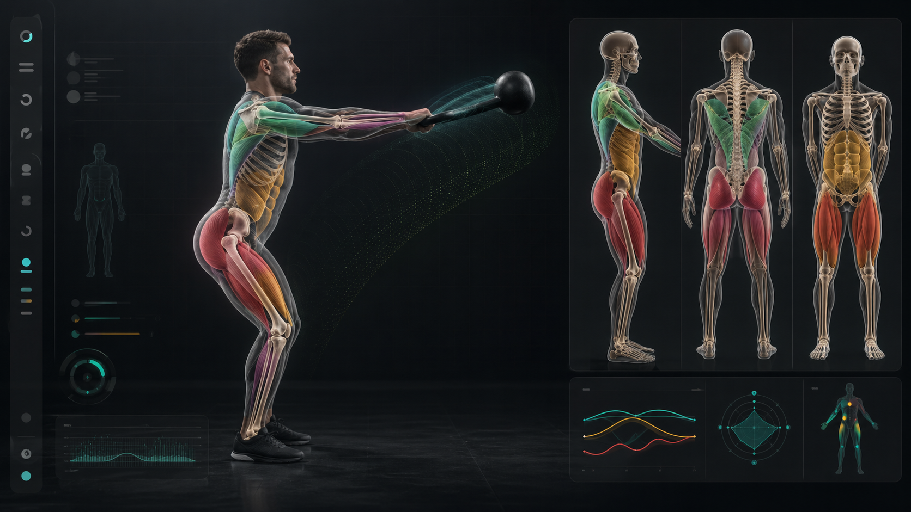

# Kettlebell Form Coach



A minimal browser-based kettlebell swing coach using on-device pose inference, personalized calibration, spatial Gaussian confidence fields, and live layered 3D anatomy.

## What It Does

- Runs MediaPipe Pose Landmarker in the browser against a webcam stream.
- Uses 33 pose landmarks plus world-coordinate landmarks for hinge, knee, torso, shoulder, and depth-path analysis.
- Calibrates to the user's standing posture before scoring reps.
- Tracks swing phase, rep count, hinge-to-knee ratio, lockout, shoulder lift, spine stack, depth travel, camera quality, and confidence.
- Transforms the mirrored camera feed into projected body, muscle, skeleton, and Gaussian correction layers.
- Shows a Three.js anatomical rig with independently toggled body, muscle, skeleton, and Gaussian field layers.
- Renders procedural muscle volumes for glutes, hamstrings, quads, calves, spinal erectors, core, lats, deltoids, and forearms with intensity tied to the current swing metrics.

## Run

```bash
npm install
npm run dev
```

Open the local Vite URL, start the camera, then calibrate while standing tall in frame before swinging.

## Research Basis

The MVP is intentionally browser-first and on-device:

- MediaPipe Pose Landmarker outputs normalized image landmarks and 3D world landmarks in meters, and supports frame-by-frame video inference in JavaScript.
  https://ai.google.dev/edge/mediapipe/solutions/vision/pose_landmarker/web_js
- BlazePose GHUM was designed for real-time, on-device 3D pose estimation from a single RGB image, making it a practical base for live coaching.
  https://arxiv.org/abs/2206.11678
- Depth Anything V2 is a stronger route for future dense pixel-depth fusion, but the current app uses pose-world depth and calibrated wrist/landmark travel so it stays performant in a live browser session.
  https://github.com/DepthAnything/Depth-Anything-V2
- Kettlebell swing research supports treating swing styles as biomechanically distinct; this app targets the hardstyle/Russian hip-hinge swing pattern, not every valid swing variation.
  https://pubmed.ncbi.nlm.nih.gov/28593086/
- Hamstring EMG research found hip-hinge swings produced greater hamstring activity than squat and double-knee-extension swing styles, which is why the coach penalizes squat-dominant reps for this target pattern.
  https://pubmed.ncbi.nlm.nih.gov/28930870/

## Accuracy Model

The coach does not claim clinical-grade motion capture. It improves reliability by combining:

- calibration against the user's upright hip, knee, torso, shoulder-width, and torso-length profile
- side-view camera quality checks
- landmark visibility and jitter weighting
- 3D hip/knee angles from world landmarks
- 2D screen-space checks for bell/hand height and camera framing
- depth travel from wrist world coordinates
- Gaussian overlays to show uncertainty and local error risk
- projected 2D anatomy layers and procedural 3D anatomy layers anchored to tracked pose landmarks

For higher precision, the next engineering step is an optional dense-depth worker using Depth Anything V2 or a WebGPU/Transformers.js depth model, fused with pose landmarks and a camera calibration routine.
